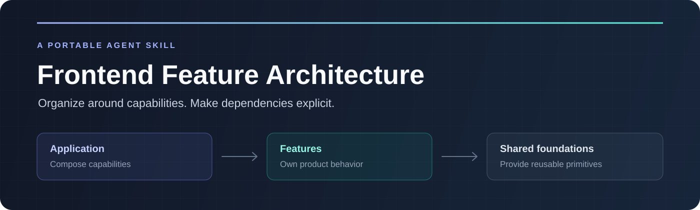
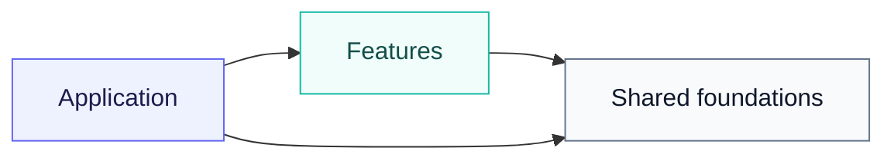

<h1 align="center">Frontend Feature Architecture</h1>

<p align="center">
  A framework-independent agent skill for cohesive frontend features and explicit dependencies.
</p>

<p align="center">
  <a href="https://github.com/Arthurblaya/frontend-feature-architecture/actions/workflows/validate.yml"></a>
  <a href="https://github.com/Arthurblaya/frontend-feature-architecture/releases"></a>
  <a href="LICENSE"></a>
  <a href="https://agentskills.io/specification"></a>
</p>

<p align="center">
  <a href="#quick-start">Quick start</a> ·
  <a href="#use-with-your-agent">Usage</a> ·
  <a href="#the-architecture">Architecture</a> ·
  <a href="#documentation">Documentation</a> ·
  <a href="#source-and-attribution">Attribution</a>
</p>

Give your coding agent a practical guide to organizing frontend code by product
capability: what each feature owns, where a new file belongs, which dependencies
are allowed, and how independent features work together.

The skill works with **Codex, Claude Code, and OpenCode**. Its guidance applies to
React, React Native, Angular, and other frontend environments; its examples use
framework-neutral pseudocode. It follows the host project's conventions and runtime
requirements and includes no ESLint configuration or plugin setup.

## Quick start

**Requirements:** Node.js 22+ and npm. The installer has no third-party dependencies.
It downloads a versioned package directly from a public GitHub Release; no Git
installation or registry account is required.

Run this from the project where you want to use the skill:

```bash
npx --allow-remote=all \
  https://github.com/Arthurblaya/frontend-feature-architecture/releases/download/v1.0.0/frontend-feature-architecture-1.0.0.tgz \
  install --harness codex
```

Replace `codex` with `claude-code`, `opencode`, or `all`.
The `--allow-remote=all` flag permits the URL download in npm 12. **With npm 11 or
earlier, omit that flag.** No global npm configuration change is needed.

| Option | Behavior |
| --- | --- |
| `--harness codex` | Install for Codex |
| `--harness claude-code` | Install for Claude Code |
| `--harness opencode` | Install for OpenCode |
| `--harness all` | Install for all three harnesses |
| `--scope user` | Make the skill available across your projects |
| `--project /path/to/project` | Choose a different existing project |
| `--dry-run` | Preview destinations without writing files |

Project scope is the default. Quote paths containing spaces. User scope cannot be
combined with `--project`. Restart or reload a running harness if it has already
scanned its skills.

<details>
<summary><strong>Installation locations and updates</strong></summary>

| Harness | Project directory | User directory |
| --- | --- | --- |
| Codex | `.agents/skills/frontend-feature-architecture/` | `~/.agents/skills/frontend-feature-architecture/` |
| Claude Code | `.claude/skills/frontend-feature-architecture/` | `~/.claude/skills/frontend-feature-architecture/` |
| OpenCode | `.opencode/skills/frontend-feature-architecture/` | `~/.config/opencode/skills/frontend-feature-architecture/` |

OpenCode user installation honors an absolute `XDG_CONFIG_HOME`. It also discovers
agent-compatible and Claude-compatible directories, so one compatible installation
may suffice when sharing the skill between harnesses. Discovery paths follow the
[official harness documentation](references/sources.md#harness-packaging-references).

The installer copies the skill, all linked references, UI metadata, license, and
attribution. It checks every selected destination before writing and never replaces
an existing file, directory, or symlink. If a copy fails, it removes only skill
installations created by that invocation; empty parent directories may remain.

To update, review the desired release, back up any local edits, remove only the
installed skill directory, and rerun the installer with that release's URL.
The installed Markdown skill does not require Node.js or network access afterward.

</details>

<details>
<summary><strong>Install from a checkout</strong></summary>

```bash
git clone https://github.com/Arthurblaya/frontend-feature-architecture.git
cd frontend-feature-architecture
node bin/frontend-feature-architecture.js install \
  --harness codex --project /path/to/your-project
```

The distribution checkout cannot install into itself. No dependency installation
is needed to run the CLI. Run `node bin/frontend-feature-architecture.js --help`
to see its options.

</details>

## Use with your agent

### Codex

```text
Use $frontend-feature-architecture to implement saved items.
Follow this project's existing framework and conventions.
```

### Claude Code

```text
/frontend-feature-architecture Implement saved items using this project's conventions.
```

### OpenCode

```text
Use the frontend-feature-architecture skill to implement saved items in this project.
```

The skill supports automatic selection where the harness enables it. Ask it to
implement a feature, decide file ownership, migrate an existing capability, or review
architectural dependencies. Implementation requests produce code and integration;
review requests produce findings within the requested scope.

## The architecture

Three responsibilities keep the dependency graph understandable:



Arrows mean **imports or dependencies**, not runtime data flow.

| Responsibility | Owns | May depend on |
| --- | --- | --- |
| **Application** | Bootstrap, navigation, layouts, and cross-feature composition | Features and shared foundations |
| **Feature** | One capability's UI, state, rules, validation, data access, and assets | Its own internals and shared foundations |
| **Shared foundation** | Independent UI primitives, transport, formatting, and platform capabilities | Other shared foundations |

Sibling features remain independent. When one capability needs another's data or
action, the application supplies a value, callback, or narrow capability contract.
Create only the folders a feature actually needs; a tiny feature does not require
an expanded scaffold or a new abstraction layer.

An illustrative structure:

```text
src/
├── app/                  # Compose capabilities and bind the runtime
├── features/
│   └── saved-items/       # Keep one capability's behavior together
│       ├── public.*
│       ├── SavedItemsPanel.*
│       ├── saved-items-data.*
│       └── saved-items-validation.*
└── shared/               # Independently reusable foundations
```

The names and `.*` extensions are illustrative. Existing source roots, framework
registration paths, naming conventions, and runtime boundaries take precedence.
Read the skill's references for the detailed placement rules and exceptions.

## Documentation

Start with [SKILL.md](SKILL.md). It routes the agent to the references relevant to
its task instead of loading the entire guide for every request.

| Guide | What it helps decide |
| --- | --- |
| [Architecture](references/architecture.md) | Feature boundaries, file ownership, state, assets, and platform adaptation |
| [Dependencies](references/boundaries.md) | Allowed imports, public surfaces, integration, permissions, and cycles |
| [Feature workflow](references/feature-workflow.md) | How to implement and integrate a capability |
| [Neutral examples](references/examples.md) | How to resolve concrete placement and composition ambiguities |
| [Migration](references/migration.md) | How to relocate a coherent feature and repair its dependencies |
| [Review](references/review.md) | How to inspect ownership and runtime reachability |
| [Sources](references/sources.md) | Original material, transcript research, and adaptation provenance |

For repository maintenance, see [Contributing](CONTRIBUTING.md),
[Release process](docs/releases.md), and [Behavioral evaluation cases](docs/evaluation-cases.md).

## Development

```bash
npm ci --ignore-scripts
npm run check
npm test
npm pack
```

Checks cover skill metadata, documentation links, reference discovery, and version
consistency. Tests cover complete payload installation, collisions, rollback,
symlinks, CLI behavior, and executing a downloaded tarball with `npx` without registry
access. CI runs on Node.js 22 and 24.

`npm pack` runs checks and tests and creates the release tarball. Only the installer,
skill, references, metadata, license, attribution, and documentation are included.
The CLI copies only the skill payload into a harness's directory.
Distribution tests verify filesystem installation; they do not establish the skill's
behavior inside every harness. Use the evaluation cases for that assessment.

## Source and attribution

The frontend organization approach comes from **Kyle Cook / Web Dev Simplified**,
his [video](https://www.youtube.com/watch?v=xyxrB2Aa7KE), and the
[example repository](https://github.com/WebDevSimplified/parity-deals-clone/tree/feature-folder-structure).
The complete English caption track and the example branch were reviewed for this
adaptation. [Source notes](references/sources.md) document timestamps, the inspected
commit, and the source's known permissions exception.

**Artur Blaya** adapted the material into this reusable skill and maintains its
distribution. The detailed workflows and neutral examples are original additions
to make the approach usable across frontend environments.

## License

[MIT](LICENSE). Original sources retain their authorship and rights;
see [NOTICE](NOTICE). This project is an independent adaptation.
